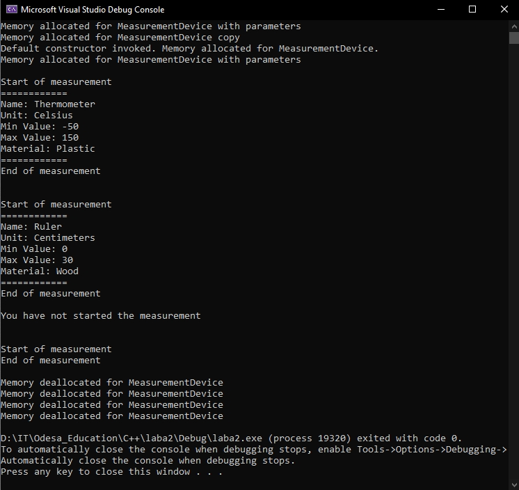

# Лабораторна робота 2. Створення класу. Конструктор. Деструктор 

Створено клас _`MeasurementDevice`_.

Клас має три конструктори: 

1. Звичайний конструктор. (Без параметрів)
2. Конструктор із параметрами.
3. Конструктор копіювання.

Також клас має деструктор, який реально звільняє пам’ять.

Об'єкти класу є в певному стані: в `активному` чи `неактивному`. Об'єкти виконують функції — їх можна запустити та зупинити.

Для демонстрації стану всіх атрибутів класу в певний час та з певною умовою застосовуючи метод print(). 

З таким вмістом `main`:

```cpp
int main() {
	MeasurementDevice thermometer("Thermometer", "Celsius", -50, 150, "Plastic");
	MeasurementDevice device2 = thermometer;
	MeasurementDevice device3;
	MeasurementDevice ruler("Ruler", "Centimeters", 0, 30, "Wood");

	thermometer.startMeasuring();
	thermometer.print();
	thermometer.stopMeasuring();

	ruler.startMeasuring();
	ruler.print();
	ruler.stopMeasuring();

	device2.print();
	device2.startMeasuring();
	device2.stopMeasuring();

	return 0;
}
```

маю ось такі результати тестування програми:


